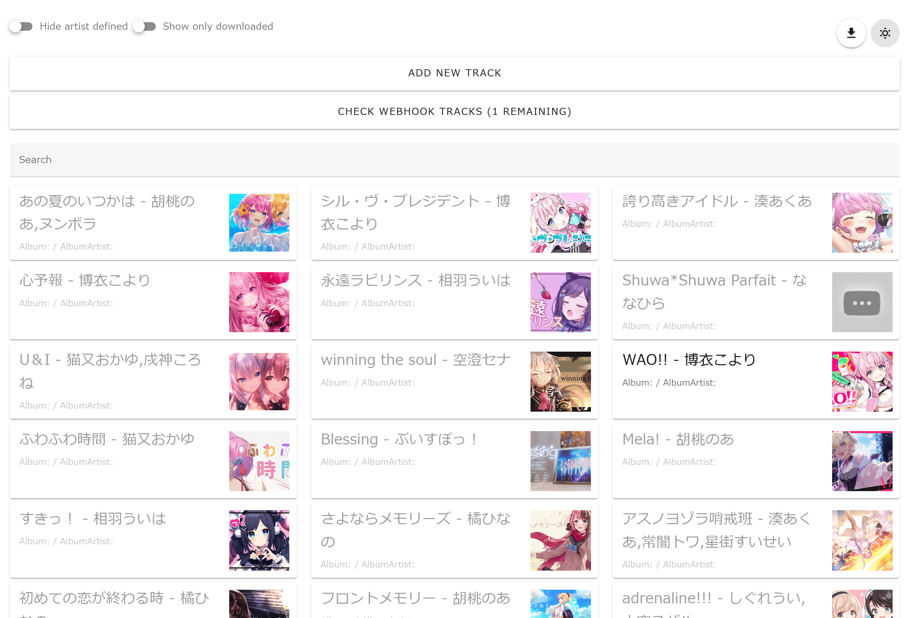
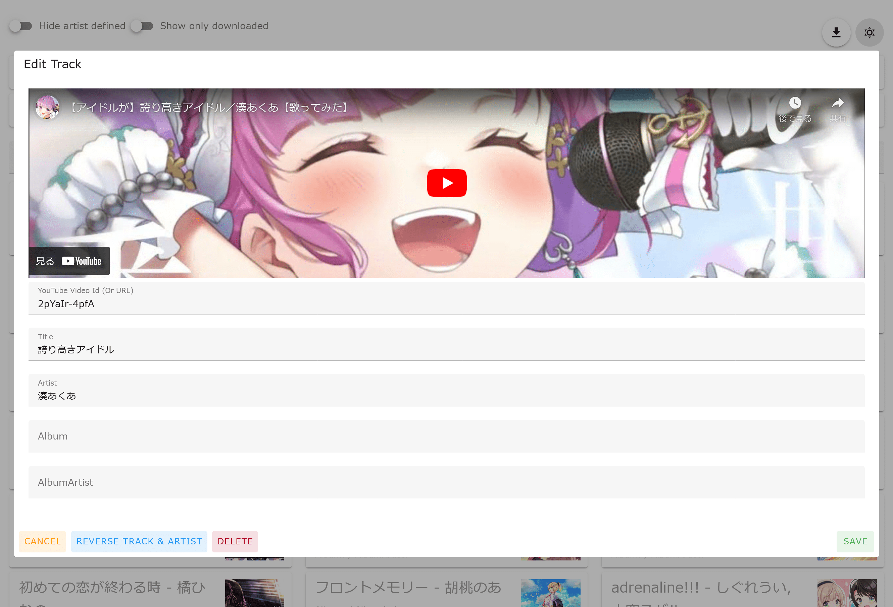
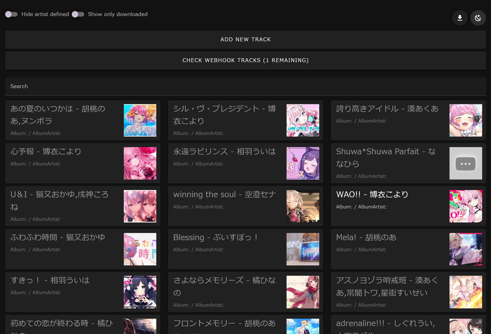
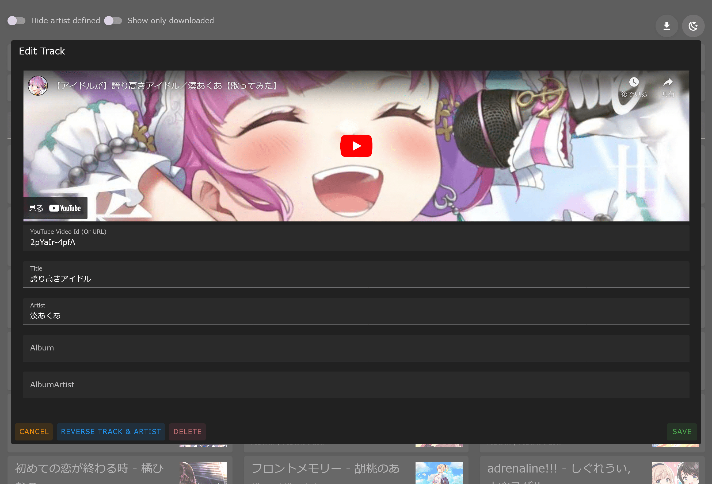

# fetch-youtube-bgm

Download playlist videos, convert to mp3 and add metadata.

## Features

- Download videos added to YouTube playlist (public or limited), convert to MP3, and add meta tags (mp3tag).
- The volume of the mp3 file is adjusted to the appropriate volume using mp3gain or replaygain.
- With a simple web UI, you can set Title, Artist, Album and Album Artist to be assigned as metadata for YouTube videos.
- You can download a JSON file in a file format that can be imported with the "Edited tracks" browser extension Web Scrobbler.
  - You can use [tomacheese/auto-update-web-scrobbler](https://github.com/tomacheese/auto-update-web-scrobbler) to automatically synchronize with Web Scrobbler.
- With an Android app such as [FolderSync](https://play.google.com/store/apps/details?id=dk.tacit.android.foldersync.lite) you can automatically store mp3 files on your smartphone.
- Google Account credentials are not required.
- Notification can be sent to Discord when a new track is added.

## Screenshots

### Light mode

| Viewer Top | Edit Track Page |
| :-: | :-: |
|  |  |

### Dark mode

| Viewer Top | Edit Track Page |
| :-: | :-: |
|  |  |

## Installation

### 1. Create a limited or public playlist on YouTube

Please see [Create & manage playlists - YouTube Help](https://support.google.com/youtube/answer/57792)

Get the ID of the playlist. This will be a string like `PLOCwArr8ScAyyr6EtRgt1TYLsOSoLBiEk`.  
You can get it from the list parameter of the playlist URL.

### 2. Create a Docker compose file

Create `compose.yaml` in any folder and write the following. Note that the strings enclosed in `<` and `>` should be replaced with the correct ones.

- `<Timezone>`: Your time zone, e.g. Asia/Tokyo.
- `<ServerHost>`: Hostname of the server on which fetch-youtube-bgm will be installed, or IP address.
- `<ViewerPort>`: Port number to expose the fetch-youtube-bgm viewer

```yaml
services:
  downloader:
    image: ghcr.io/tomacheese/fetch-youtube-bgm-downloader
    environment:
      - TZ=<Timezone>
      - BASE_URL=http://<ServerHost>:<ViewerPort>
    volumes:
      - type: bind
        source: ./data
        target: /data
    restart: always
    init: true

  viewer:
    image: ghcr.io/tomacheese/fetch-youtube-bgm-viewer
    ports:
      - "<ViewerPort>:80"
    environment:
      - TZ=<Timezone>
      - BASE_URL=http://<ServerHost>:<ViewerPort>
    volumes:
      - type: bind
        source: ./data
        target: /data
    restart: always
    init: true
```

### 3. Create a configuration file

Create `data/config.json` and write the following JSON. Note that the strings enclosed in `<` and `>` should be replaced with the correct ones.

- `<YouTubePlaylistId>`: The ID of the playlist you have just obtained
- `<DiscordWebhookUrl>`: Discord Webhook Url (Optional)
- `<DiscordBotToken>`: Discord Bot Token (Optional)
- `<DiscordChannelId>`: Discord Channel Id (Optional)

```json
{
  "playlistId": "<YouTubePlaylistId>",
  "discord": { // Optional
    "webhook_url": "<DiscordWebhookUrl>"
    // Or Bot token and channel ID
    // "token": "<DiscordBotToken>",
    // "channel_id": "<DiscordChannelId>"
  }
}
```

### 4. Run

Execute the following command:

```shell
docker compose up --build -d
```

## License

The license for this project is [MIT License](LICENSE).
